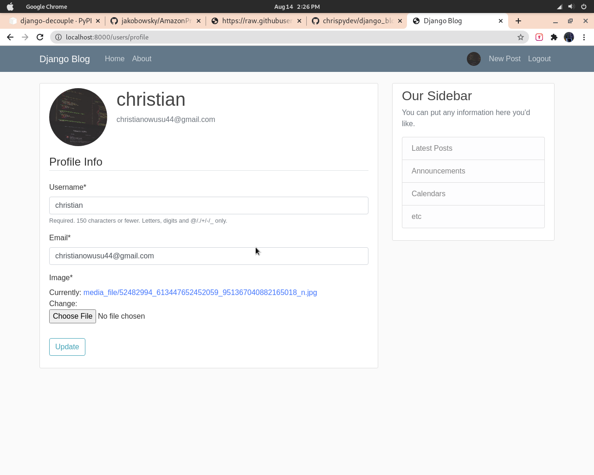

# This is a full featured django blog app built with django==2.2

1. This include the a form to create new users.
2. A form to create a post, delete a post and update a post.
3. A form to update a profile page for users.
4. An admin page to edit the data base.

## Set up the project

1. You create a virtualenv with

```buildoutcfg
    python3 -m venv venv
    source venv/bin/activate
```

2. Install all requirements with

```buildoutcfg
    pip3 install -r requirements.txt
    python3 manage.py runserver
```

3. Admin Username:Christian, password:testing321 and you are good to go.
